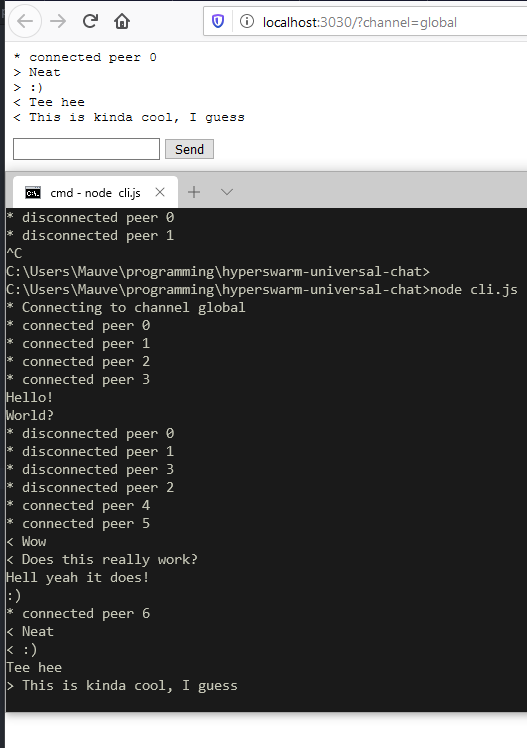

# hyperswarm-universal-chat
A basic demo showing how you can make a p2p chat using hyperswarm.



## Intro

Chat apps are the hello world of p2p stuff, here's a hello world you can build off of.

## Properties:

- As P2P as it gets, no central authorities
- Works in node using hyperswarm and in the browser with hyperswarm-web
- Just echoes your peers' messages, nothing fancy
- Messages are totally ephemeral, if you missed it you missed it

## API

```js
const HyperswarmUniversalChat = require('hyperswarm-universal-chat')

const chat = HyperswarmUniversalChat({
  swarm: null // Optional hyperswarm instance
})

// Join a channel and start getting peers
const channel = chat.channel('some name, who cares what it is, really')

channel.on('message', (peer, {message}) => {
  console.log(`${message}`)
})

channel.on('peer', (peer) => {
  console.log(`* connected to ${peer} *`)

  connection.once('end', () => {
    console.log(`* disconnected from ${peer} *`)
  })
})

channel.send('Hello world!')

channel.close()

chat.destroy(() => {
  console.log('Quit')
})
```

## How?

- Join a channel
- Derive key by hashing channel name
- Look for peers using key
- Connect to as many as you can
- Parse the connection with NDJSON
- When you establish the connection, send the key you're connecting from
- When you get a connection, listen for the key before doing anything (read 32 bytes?)
- When you get a message, take the message and print it.

## Areas for improvement (WONTFIX)

- Deduplicate connections (OH WELL, it's a demo, you can figure it out. :P)
- Gossip of messages from peers
- Usernames
- Verifying users with signed messages
- Encryption of connections
